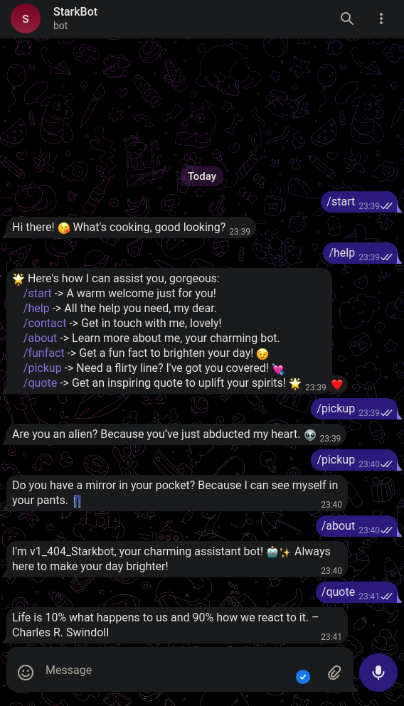

<h1>v1_404_Starkbot</h1>
    
Welcome to the v1_404_Starkbot project! v1_404_Starkbot is a charming and engaging Telegram bot designed to entertain and interact with users through various commands. This bot offers fun facts, pickup lines, quotes, and more!

    
<h2>Features</h2>
    <ul>
        <li><strong>Welcome Message</strong>: Sends a warm and flirty welcome message.</li>
        <li><strong>Contact Info</strong>: Provides contact information.</li>
        <li><strong>Help</strong>: Lists all available commands and their descriptions.</li>
        <li><strong>About</strong>: Shares information about the bot.</li>
        <li><strong>Fun Facts</strong>: Sends a random fun fact to brighten the user's day.</li>
        <li><strong>Pickup Lines</strong>: Sends a random flirty pickup line.</li>
        <li><strong>Quotes</strong>: Sends a random inspirational quote.</li>
    </ul>
    
<h2>Commands</h2>
    <ul>
        <li><code>/start</code>: Sends a warm welcome message.</li>
        <li><code>/contact</code>: Provides contact information.</li>
        <li><code>/help</code>: Lists all available commands and their descriptions.</li>
        <li><code>/about</code>: Shares information about the bot.</li>
        <li><code>/funfact</code>: Sends a random fun fact.</li>
        <li><code>/pickup</code>: Sends a random flirty pickup line.</li>
        <li><code>/quote</code>: Sends a random inspirational quote.</li>
    </ul>
    
<h2>Installation</h2>
    <ol>
        <li>Clone the repository:
            <pre>https://github.com/Dark-Programer/FlirtBot-Starkbot.git</pre>
        </li>
        <li>Navigate to the project directory:
            <pre><code>cd FlirtBot-Starkbot</code></pre>
        </li>
        <li>Install the required dependencies:
            <pre><code>pip install -r requirements.txt</code></pre>
        </li>
        <li>Create a <code>token.txt</code> file in the <code>Projects/Telegram Bot</code> directory and add your Telegram bot token in it.</li>
        <li>Run the bot:
            <pre><code>python bot.py</code></pre>
        </li>
    </ol>
    
<h2>Usage</h2>
    
Once the bot is running, you can interact with it on Telegram by sending any of the supported commands. Enjoy the fun facts, pickup lines, and inspirational quotes that v1_404_Starkbot has to offer!

    
<h2>Contributing</h2>
    
Contributions are welcome! If you have any ideas for new features or improvements, feel free to open an issue or submit a pull request.

<h2>Author</h2>
    
Arka Chakraborty

<h2>Screenshots</h2>
    
